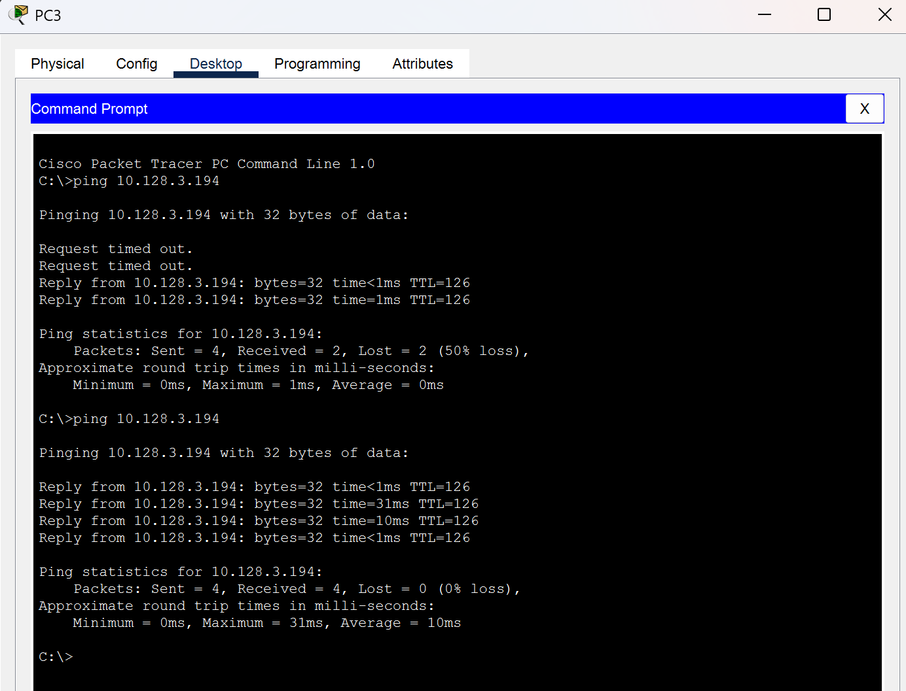
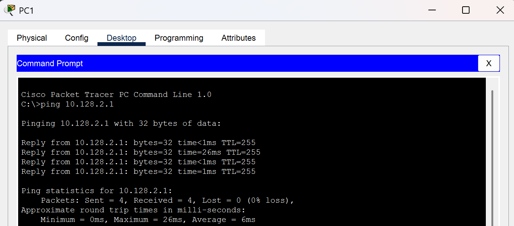
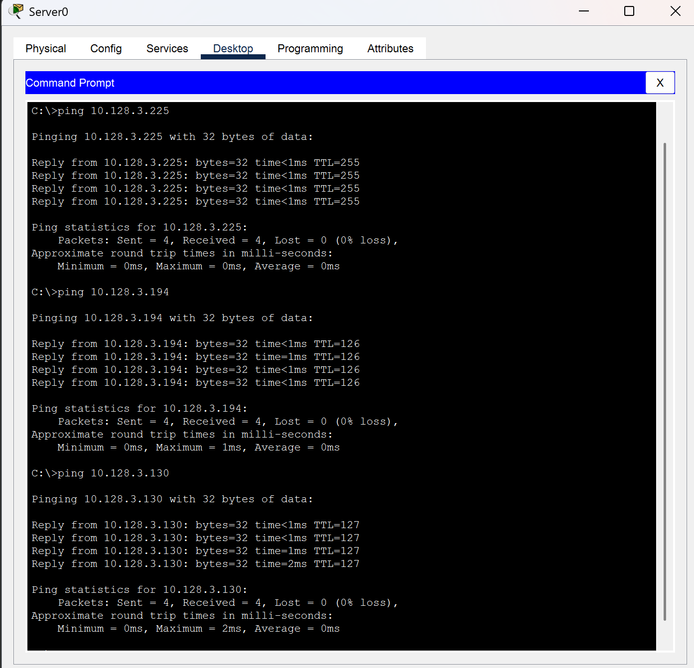

# I Gede Bagus Saka Sinatrya - 5027241088

## Perhitungan Supernetting CIDR

### 1.Menentukan Jaringan (Input)
Kita mulai dengan mengidentifikasi semua jaringan yang ingin kita gabungkan. Dari "Tabel Visualisasi Supernetting", kita memiliki 5 jaringan ini:
- 10.128.0.0/23 (Sekretariat)
- 10.128.2.0/24 (Kurikulum)
- 10.128.3.0/25 (Guru & Tendik)
- 10.128.3.128/26 (Sarpras)
- 10.128.3.224/29 (Server & Admin)

### 2. Mencari Network ID dan Prefix
- Cari Alamat Terendah: Lihat daftar di atas. Alamat network paling awal adalah 10.128.0.0. Ini menjadi Network ID Supernet kita.
- Cari Alamat Tertinggi: Kita perlu tahu alamat tertinggi yang digunakan. Alamat tertinggi adalah Broadcast ID dari jaringan Server & Admin, yaitu 10.128.3.231 (dari perhitungan VLSM sebelumnya).
- Bandingkan dalam Biner: Kita bandingkan biner dari alamat terendah (10.128.0.0) dan tertinggi (10.128.3.231).
  `Alamat Terendah: 00001010.10000000.00000000.00000000`
  `Alamat Tertinggi: 00001010.10000000.00000011.11100111`

  Fokus ke oktet ke 3
  `Oktet 3 (0): 00000000`
  `Oktet 3 (3): 00000011`
- Hitung Bit yang Sama: Kita lihat bit-nya sama untuk 6 posisi pertama (000000). Bit-nya mulai berbeda di posisi ke-7.
- Tentukan Prefix: Jumlah total bit yang sama dari awal adalah:
  8 (Oktet 1) + 8 (Oktet 2) + 6 (Oktet 3) = 22 bit.
- Ini memberi kita Prefix /22.

### 3. Mencari Mask
Mask hanyalah cara penulisan lain dari Prefix /22.
- /22 berarti ada 22 bit angka "1" diikuti oleh 10 bit angka "0".
- Biner: 11111111 . 11111111 . 11111100 . 00000000
- Desimal: 255.255.252.0

### 4. Mencari Broadcast
Broadcast ID adalah alamat terakhir di dalam blok supernet 10.128.0.0/22
- Kita tahu prefix-nya /22, yang menyisakan 10 bit untuk host ($32 - 22 = 10).
- Ukuran blok ini adalah $2^{10} = 1024$ alamat.
- Blok 1024 alamat ini mencakup: 10.128.0.x (256 alamat) | 10.128.1.x (256 alamat) | 10.128.2.x (256 alamat) | 10.128.3.x (256 alamat)
- Alamat terakhir di blok ini adalah alamat terakhir di 10.128.3.x
- Hasilnya adalah 10.128.3.255

### 5. Mencari Range Host
Range Host adalah semua alamat yang dapat digunakan yang berada di antara Network ID dan Broadcast ID.
- Host Pertama: Network ID + 1 $\rightarrow$ 10.128.0.0 + 1 = 10.128.0.1
- Host Terakhir: Broadcast ID - 1 $\rightarrow$ 10.128.3.255 - 1 = 10.128.3.254
- Hasilnya adalah 10.128.0.1 - 10.128.3.254

### 6. Mencari Gateway
Supernet adalah rute ringkasan logis, bukan LAN fisik. Jadi tidak memiliki satu "pintu keluar" (gateway) spesifik. Oleh karena itu, kolom ini diisi (N/A).
  
## Konfigurasi IP & Command CLI

### 1. Konfigurasi 4 Switch di Kantor Pusat (Membuat "kamar" VLAN)

#### 1.1 SW_Sekretariat
```
hostname SW_Sekretariat

//Buat VLAN 10
vlan 10
 name LAN_Sekretariat

//Masukkan port Router & PC ke VLAN 10
interface range FastEthernet0/1 - 2
 switchport mode access
 switchport access vlan 10

end
write memory
```

#### 1.2 SW_Kurikulum
```
hostname SW_Kurikulum

vlan 20
 name LAN_Kurikulum

interface range FastEthernet0/1 - 2
 switchport mode access
 switchport access vlan 20

end
write memory
```

#### 1.3 SW_GuruTendik
```
hostname SW_GuruTendik

vlan 30
 name LAN_GuruTendik

interface range FastEthernet0/1 - 2
 switchport mode access
 switchport access vlan 30

end
write memory
```

#### 1.4 SW_Sarpras
```
hostname SW_Sarpras

vlan 40
 name LAN_Sarpras

interface range FastEthernet0/1 - 2
 switchport mode access
 switchport access vlan 40

end
write memory
```

### 2. Konfigurasi Router (Gateway & Routing)

#### 2.1 R_KantorPusat
```
hostname R_KantorPusat

! === BUAT INTERFACE VIRTUAL (SVI) UNTUK GATEWAY ===
interface Vlan10
 description Gateway_Sekretariat
 ip address 10.128.0.1 255.255.254.0
 no shutdown
 exit

interface Vlan20
 description Gateway_Kurikulum
 ip address 10.128.2.1 255.255.255.0
 no shutdown
 exit

interface Vlan30
 description Gateway_GuruTendik
 ip address 10.128.3.1 255.255.255.128
 no shutdown
 exit

interface Vlan40
 description Gateway_Sarpras
 ip address 10.128.3.129 255.255.255.192
 no shutdown
 exit

! === MASUKKAN PORT FISIK KE VLAN ===
interface GigabitEthernet0/1/0
 description --- ke SW_Sekretariat ---
 switchport mode access
 switchport access vlan 10
 no shutdown
 exit

interface GigabitEthernet0/1/1
 description --- ke SW_Kurikulum ---
 switchport mode access
 switchport access vlan 20
 no shutdown
 exit

interface GigabitEthernet0/1/2
 description --- ke SW_GuruTendik ---
 switchport mode access
 switchport access vlan 30
 no shutdown
 exit

interface GigabitEthernet0/1/3
 description --- ke SW_Sarpras ---
 switchport mode access
 switchport access vlan 40
 no shutdown
 exit

! === KONFIGURASI PORT L3 BAWAAN ===
! Port ke Server
interface GigabitEthernet0/0/0
 description LAN_Server_Admin
 ip address 10.128.3.225 255.255.255.248
 no shutdown
 exit

! Port ke Kantor Cabang (WAN)
interface GigabitEthernet0/0/1
 description Link_WAN_ke_Cabang
 ip address 10.128.3.233 255.255.255.252
 no shutdown
 exit

! === STATIC ROUTING ===
! Cara menuju LAN Pengawas
ip route 10.128.3.192 255.255.255.224 10.128.3.234

end
write memory
```

#### 2.2 R_KantorCabang
```
hostname R_KantorCabang

! === KONFIGURASI PORT L3 BAWAAN ===

! Port ke LAN Pengawas 
interface GigabitEthernet0/0/0
 description LAN_Pengawas
 ip address 10.128.3.193 255.255.255.224
 no shutdown
 exit

! Port ke Kantor Pusat (WAN) 
interface GigabitEthernet0/0/1
 description Link_WAN_ke_Pusat
 ip address 10.128.3.234 255.255.255.252
 no shutdown
 exit

! === STATIC ROUTING (SUPERNET) ===
! Cara menuju SEMUA LAN di Kantor Pusat (Hasil CIDR)
ip route 10.128.0.0 255.255.252.0 10.128.3.233

end
write memory
```

### Fase 3: Konfigurasi Host (PC/Server)

PC-PT3 (Sekretariat):
- IP: 10.128.0.2
- Mask: 255.255.254.0
- Gateway: 10.128.0.1

PC-PT1 (Kurikulum):
- IP: 10.128.2.2
- Mask: 255.255.255.0
- Gateway: 10.128.2.1

PC-PT2 (Guru & Tendik):
- IP: 10.128.3.2
- Mask: 255.255.255.128
- Gateway: 10.128.3.1

PC-PT0 (Sarpras):
- IP: 10.128.3.130
- Mask: 255.255.255.192
- Gateway: 10.128.3.129

Server-PT0 (Server & Admin):
- IP: 10.128.3.226
- Mask: 255.255.255.248
- Gateway: 10.128.3.225

PC-PT6 (Pengawas - Cabang):
- IP: 10.128.3.194
- Mask: 255.255.255.224
- Gateway: 10.128.3.193

## Dokumentasi Topologi 


## Tes PING ke Kantor Cabang


## Tes PING ke Lokal


## Tes Ping antar VLAN

